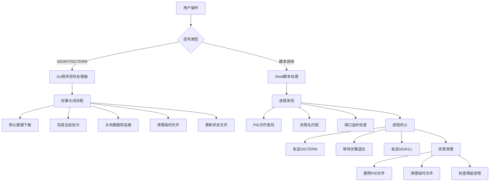

# Data4BT 信号处理机制

本文档详细介绍Data4BT项目中的信号处理机制，包括设计原理、实现细节和最佳实践。

## 目录

- [概述](#概述)
- [信号处理架构](#信号处理架构)
- [Go程序信号处理](#go程序信号处理)
- [Shell脚本信号处理](#shell脚本信号处理)
- [进程管理机制](#进程管理机制)
- [最佳实践](#最佳实践)
- [故障排除](#故障排除)
- [性能考虑](#性能考虑)

## 概述

### 问题背景

Data4BT项目在早期版本中存在以下信号处理问题：

1. **Ctrl+C无响应**: 用户按下Ctrl+C后程序无法及时响应
2. **进程残留**: 程序退出后仍有子进程或相关进程继续运行
3. **资源泄漏**: 临时文件、网络连接等资源未能正确清理
4. **数据不一致**: 强制终止可能导致数据写入不完整

### 解决方案概览

我们实现了一套完整的信号处理机制：

- **Go程序层面**: 优雅的信号处理和资源清理
- **Shell脚本层面**: 智能进程管理和监控
- **系统层面**: 多种进程查找和终止策略

## 信号处理架构

### 整体架构图



### 信号流程

1. **信号接收**: 捕获SIGINT、SIGTERM等信号
2. **状态检查**: 确定当前程序状态和正在执行的操作
3. **优雅关闭**: 完成关键操作，保存状态
4. **资源清理**: 释放文件句柄、网络连接等资源
5. **进程退出**: 安全退出程序

## Go程序信号处理

### 信号处理器实现

```go
// internal/signal/handler.go
package signal

import (
    "context"
    "os"
    "os/signal"
    "sync"
    "syscall"
    "time"
)

type Handler struct {
    ctx        context.Context
    cancel     context.CancelFunc
    shutdownCh chan struct{}
    mu         sync.RWMutex
    handlers   []func() error
}

func NewHandler() *Handler {
    ctx, cancel := context.WithCancel(context.Background())
    return &Handler{
        ctx:        ctx,
        cancel:     cancel,
        shutdownCh: make(chan struct{}),
        handlers:   make([]func() error, 0),
    }
}

func (h *Handler) Start() {
    sigCh := make(chan os.Signal, 1)
    signal.Notify(sigCh, syscall.SIGINT, syscall.SIGTERM)
    
    go func() {
        sig := <-sigCh
        log.Printf("收到信号: %v，开始优雅关闭...", sig)
        h.shutdown()
    }()
}

func (h *Handler) shutdown() {
    h.mu.Lock()
    defer h.mu.Unlock()
    
    // 设置关闭超时
    ctx, cancel := context.WithTimeout(context.Background(), 30*time.Second)
    defer cancel()
    
    // 执行清理函数
    for i := len(h.handlers) - 1; i >= 0; i-- {
        if err := h.handlers[i](); err != nil {
            log.Printf("清理函数执行失败: %v", err)
        }
    }
    
    h.cancel()
    close(h.shutdownCh)
}
```

### 在主程序中的使用

```go
// cmd/main.go
func main() {
    // 创建信号处理器
    signalHandler := signal.NewHandler()
    
    // 注册清理函数
    signalHandler.RegisterCleanup(func() error {
        log.Info("停止数据下载器...")
        downloader.Stop()
        return nil
    })
    
    signalHandler.RegisterCleanup(func() error {
        log.Info("关闭数据库连接...")
        return db.Close()
    })
    
    signalHandler.RegisterCleanup(func() error {
        log.Info("清理临时文件...")
        return cleanupTempFiles()
    })
    
    // 启动信号处理
    signalHandler.Start()
    
    // 主程序逻辑
    if err := runMainLogic(signalHandler.Context()); err != nil {
        log.Fatal(err)
    }
    
    // 等待优雅关闭完成
    <-signalHandler.Done()
    log.Info("程序已安全退出")
}
```

### 上下文传播

```go
// 在各个组件中使用上下文
func (d *Downloader) Download(ctx context.Context, symbol string) error {
    for {
        select {
        case <-ctx.Done():
            log.Info("收到停止信号，停止下载")
            return ctx.Err()
        default:
            // 执行下载逻辑
            if err := d.downloadFile(symbol); err != nil {
                return err
            }
        }
    }
}
```

## Shell脚本信号处理

### start.sh 信号处理

```bash
#!/bin/bash
# start.sh - 改进的启动脚本

set -euo pipefail

# 全局变量
MAIN_PID=""
CLEANUP_DONE=false

# 信号处理函数
cleanup() {
    if [ "$CLEANUP_DONE" = "true" ]; then
        return 0
    fi
    
    CLEANUP_DONE=true
    log_info "收到退出信号，开始清理..."
    
    # 停止主进程
    if [ -n "$MAIN_PID" ] && kill -0 "$MAIN_PID" 2>/dev/null; then
        log_info "停止主进程: $MAIN_PID"
        kill -TERM "$MAIN_PID" 2>/dev/null || true
        
        # 等待进程退出
        local timeout=30
        while [ $timeout -gt 0 ] && kill -0 "$MAIN_PID" 2>/dev/null; do
            sleep 1
            ((timeout--))
        done
        
        # 强制终止
        if kill -0 "$MAIN_PID" 2>/dev/null; then
            log_warn "强制终止进程: $MAIN_PID"
            kill -KILL "$MAIN_PID" 2>/dev/null || true
        fi
    fi
    
    # 清理PID文件
    rm -f ".data_loader_pid"
    
    log_info "清理完成"
    exit 0
}

# 注册信号处理器
trap cleanup SIGINT SIGTERM EXIT

# 启动主程序
start_main_process() {
    log_info "启动数据加载器..."
    
    # 启动Go程序并获取PID
    go run cmd/main.go -cmd=run &
    MAIN_PID=$!
    
    # 保存PID到文件
    echo "$MAIN_PID" > ".data_loader_pid"
    
    log_info "主进程已启动，PID: $MAIN_PID"
    
    # 等待主进程完成
    wait "$MAIN_PID"
}
```

### stop.sh 进程管理

```bash
#!/bin/bash
# stop.sh - 智能停止脚本

source "scripts/process_manager.sh"

# 主停止函数
stop_data4bt() {
    log_info "开始停止Data4BT相关进程..."
    
    # 查找所有相关进程
    local pids
    pids=$(find_data4bt_processes)
    
    if [ -z "$pids" ]; then
        log_info "未发现运行中的Data4BT进程"
        return 0
    fi
    
    log_info "发现以下进程:"
    show_process_info "$pids"
    
    # 优雅关闭
    log_info "发送TERM信号进行优雅关闭..."
    echo "$pids" | while read -r pid; do
        if [ -n "$pid" ]; then
            send_signal_to_process "$pid" "TERM"
        fi
    done
    
    # 等待进程退出
    local timeout="$GRACEFUL_TIMEOUT"
    while [ $timeout -gt 0 ]; do
        local remaining_pids
        remaining_pids=$(find_data4bt_processes)
        
        if [ -z "$remaining_pids" ]; then
            log_success "所有进程已优雅退出"
            return 0
        fi
        
        sleep 1
        ((timeout--))
    done
    
    # 强制终止
    local remaining_pids
    remaining_pids=$(find_data4bt_processes)
    
    if [ -n "$remaining_pids" ]; then
        log_warn "强制终止剩余进程..."
        echo "$remaining_pids" | while read -r pid; do
            if [ -n "$pid" ]; then
                send_signal_to_process "$pid" "KILL"
            fi
        done
    fi
    
    # 清理资源
    cleanup_resources
}
```

## 进程管理机制

### 进程发现策略

我们实现了多种进程发现方式，确保能够找到所有相关进程：

#### 1. PID文件查找

```bash
find_process_by_pidfile() {
    local pidfile="$1"
    
    if [ ! -f "$pidfile" ]; then
        return 1
    fi
    
    local pid
    pid=$(cat "$pidfile" 2>/dev/null || true)
    
    if [ -n "$pid" ] && is_process_running "$pid"; then
        echo "$pid"
        return 0
    fi
    
    return 1
}
```

#### 2. 进程名匹配

```bash
find_processes_by_name() {
    local pattern="$1"
    
    # 使用pgrep查找匹配的进程
    pgrep -f "$pattern" 2>/dev/null || true
}
```

#### 3. 端口监听检查

```bash
find_processes_by_port() {
    local port="$1"
    
    # 使用lsof查找监听端口的进程
    if command -v lsof >/dev/null 2>&1; then
        lsof -ti ":$port" 2>/dev/null || true
    else
        # 备用方法：使用netstat
        netstat -tlnp 2>/dev/null | grep ":$port " | \
            awk '{print $7}' | cut -d'/' -f1 | grep -E '^[0-9]+$' || true
    fi
}
```

### 综合进程查找

```bash
find_data4bt_processes() {
    local pids=()
    
    # 方法1: PID文件
    if temp_pid=$(find_process_by_pidfile ".data_loader_pid"); then
        pids+=("$temp_pid")
    fi
    
    # 方法2: 进程名模式
    local patterns=(
        "go run.*cmd/main.go"
        "data4bt"
        "binance-data-loader"
    )
    
    for pattern in "${patterns[@]}"; do
        while IFS= read -r temp_pid; do
            if [ -n "$temp_pid" ]; then
                pids+=("$temp_pid")
            fi
        done < <(find_processes_by_name "$pattern")
    done
    
    # 方法3: 端口检查
    local ports=("8890" "8080")
    for port in "${ports[@]}"; do
        while IFS= read -r temp_pid; do
            if [ -n "$temp_pid" ]; then
                pids+=("$temp_pid")
            fi
        done < <(find_processes_by_port "$port")
    done
    
    # 去重并输出
    if [ ${#pids[@]} -gt 0 ]; then
        printf '%s\n' "${pids[@]}" | sort -u | grep -E '^[0-9]+$'
    fi
}
```

### 进程终止策略

```bash
stop_data4bt_processes() {
    local graceful_timeout="$1"
    local force_timeout="$2"
    
    local pids
    pids=$(find_data4bt_processes)
    
    if [ -z "$pids" ]; then
        log_info "未发现运行中的进程"
        return 0
    fi
    
    # 阶段1: 优雅关闭 (SIGTERM)
    log_info "发送TERM信号，等待优雅关闭..."
    echo "$pids" | while read -r pid; do
        send_signal_to_process "$pid" "TERM"
    done
    
    # 等待优雅关闭
    if wait_for_processes_exit "$pids" "$graceful_timeout"; then
        log_success "所有进程已优雅退出"
        cleanup_resources
        return 0
    fi
    
    # 阶段2: 强制终止 (SIGKILL)
    local remaining_pids
    remaining_pids=$(find_data4bt_processes)
    
    if [ -n "$remaining_pids" ]; then
        log_warn "强制终止剩余进程..."
        echo "$remaining_pids" | while read -r pid; do
            send_signal_to_process "$pid" "KILL"
        done
        
        # 等待强制终止完成
        wait_for_processes_exit "$remaining_pids" "$force_timeout"
    fi
    
    cleanup_resources
    return 0
}
```

## 最佳实践

### 1. 信号处理设计原则

- **快速响应**: 信号处理器应该尽快响应，避免阻塞操作
- **幂等性**: 多次调用清理函数应该是安全的
- **超时保护**: 设置合理的超时时间，避免无限等待
- **错误处理**: 优雅地处理清理过程中的错误

### 2. 资源清理顺序

```go
// 推荐的清理顺序
func setupCleanup(handler *signal.Handler) {
    // 1. 停止新的请求接收
    handler.RegisterCleanup(stopAcceptingRequests)
    
    // 2. 完成正在处理的请求
    handler.RegisterCleanup(finishPendingRequests)
    
    // 3. 关闭数据库连接
    handler.RegisterCleanup(closeDatabaseConnections)
    
    // 4. 清理临时文件
    handler.RegisterCleanup(cleanupTempFiles)
    
    // 5. 更新状态文件
    handler.RegisterCleanup(updateStatusFiles)
}
```

### 3. 上下文使用规范

```go
// 正确的上下文传播
func processData(ctx context.Context, data []byte) error {
    // 在长时间运行的循环中检查上下文
    for i, item := range data {
        select {
        case <-ctx.Done():
            log.Printf("处理被中断，已完成 %d/%d", i, len(data))
            return ctx.Err()
        default:
            if err := processItem(item); err != nil {
                return err
            }
        }
    }
    return nil
}
```

### 4. 脚本信号处理模板

```bash
#!/bin/bash
# 脚本信号处理模板

set -euo pipefail

# 全局状态
CLEANUP_DONE=false
CHILD_PIDS=()

# 清理函数
cleanup() {
    if [ "$CLEANUP_DONE" = "true" ]; then
        return 0
    fi
    CLEANUP_DONE=true
    
    echo "开始清理..."
    
    # 停止子进程
    for pid in "${CHILD_PIDS[@]}"; do
        if kill -0 "$pid" 2>/dev/null; then
            kill -TERM "$pid" 2>/dev/null || true
        fi
    done
    
    # 等待子进程退出
    for pid in "${CHILD_PIDS[@]}"; do
        wait "$pid" 2>/dev/null || true
    done
    
    # 清理资源
    rm -f /tmp/script_$$_*
    
    echo "清理完成"
}

# 注册信号处理器
trap cleanup SIGINT SIGTERM EXIT

# 启动子进程并记录PID
start_background_task() {
    some_command &
    local pid=$!
    CHILD_PIDS+=("$pid")
    echo "启动后台任务，PID: $pid"
}
```

## 故障排除

### 常见问题

#### 1. 信号处理器未响应

**症状**: 按下Ctrl+C后程序没有反应

**可能原因**:
- 信号处理器未正确注册
- 程序在执行阻塞操作
- 信号被其他处理器屏蔽

**解决方案**:
```bash
# 检查进程状态
ps aux | grep -E "(data4bt|go run)"

# 发送不同信号测试
kill -TERM <pid>
kill -INT <pid>

# 使用强制停止脚本
./stop.sh --force-timeout 5
```

#### 2. 进程残留

**症状**: 程序退出后仍有相关进程运行

**诊断**:
```bash
# 查找残留进程
./stop.sh --dry-run

# 检查进程树
pstree -p | grep -E "(data4bt|go)"
```

**解决方案**:
```bash
# 使用停止脚本清理
./stop.sh --verbose

# 手动清理
pkill -f "go run.*cmd/main.go"
```

#### 3. 资源泄漏

**症状**: 临时文件或网络连接未清理

**检查方法**:
```bash
# 检查临时文件
ls -la /tmp/ | grep data4bt

# 检查网络连接
netstat -an | grep :8890

# 检查文件句柄
lsof -p <pid>
```

### 调试技巧

#### 1. 启用详细日志

```bash
# 启动时启用调试模式
DEBUG=true ./start.sh --verbose

# 或者在Go程序中
go run cmd/main.go -cmd=run -verbose
```

#### 2. 监控信号处理

```bash
# 使用strace监控系统调用
strace -e signal -p <pid>

# 监控进程状态变化
watch -n 1 'ps aux | grep data4bt'
```

#### 3. 测试信号处理

```bash
# 创建测试脚本
cat > test_signal.sh << 'EOF'
#!/bin/bash
echo "启动测试进程..."
./start.sh --test &
TEST_PID=$!

echo "等待5秒..."
sleep 5

echo "发送SIGTERM信号..."
kill -TERM $TEST_PID

echo "等待进程退出..."
wait $TEST_PID
echo "测试完成"
EOF

chmod +x test_signal.sh
./test_signal.sh
```

## 性能考虑

### 1. 信号处理性能

- **避免在信号处理器中执行重操作**
- **使用异步清理机制**
- **设置合理的超时时间**

### 2. 进程查找优化

```bash
# 优化进程查找性能
find_processes_optimized() {
    # 优先使用最快的方法
    if [ -f ".data_loader_pid" ]; then
        local pid
        pid=$(cat ".data_loader_pid")
        if is_process_running "$pid"; then
            echo "$pid"
            return 0
        fi
    fi
    
    # 备用方法
    pgrep -f "go run.*cmd/main.go" || true
}
```

### 3. 内存使用优化

```go
// 避免在信号处理器中分配大量内存
func (h *Handler) shutdown() {
    // 使用预分配的缓冲区
    // 避免在清理过程中进行内存分配
    
    for _, cleanup := range h.cleanupFuncs {
        if err := cleanup(); err != nil {
            // 记录错误但继续清理
            log.Printf("清理错误: %v", err)
        }
    }
}
```

## 总结

Data4BT的信号处理机制通过以下几个层面确保了程序的可靠性：

1. **Go程序层面**: 实现了完善的信号处理器和上下文传播机制
2. **Shell脚本层面**: 提供了智能的进程管理和监控功能
3. **系统层面**: 采用多种策略确保进程能够被正确发现和终止

这套机制解决了原有的Ctrl+C无响应问题，提供了可靠的进程管理能力，确保了数据的完整性和系统资源的正确清理。

通过遵循本文档中的最佳实践和故障排除指南，开发者可以构建更加健壮和用户友好的应用程序。