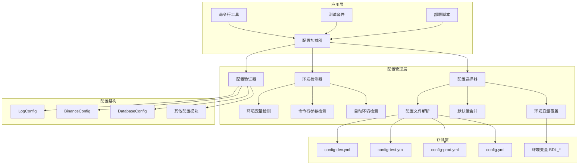
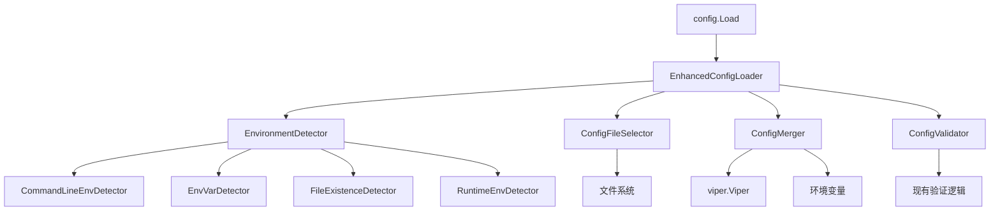
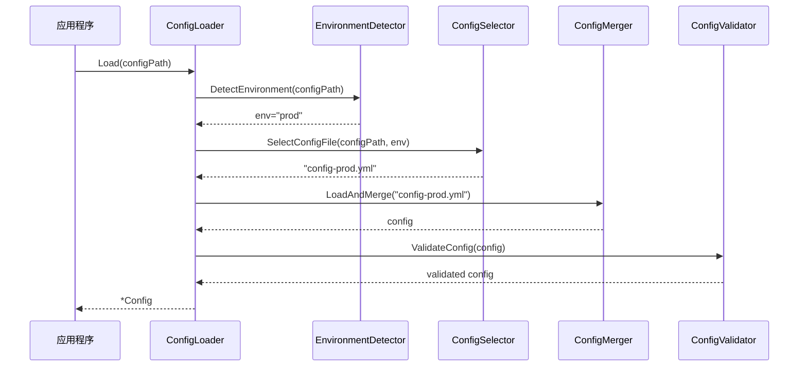

# 多环境配置系统 - Architect阶段设计

## 整体架构设计

### 系统架构图



### 核心组件设计

#### 1. 环境检测器 (EnvironmentDetector)

**职责**：检测当前运行环境

**检测策略**：
```go
type EnvironmentDetector struct {
    detectors []EnvDetector
}

type EnvDetector interface {
    Detect() (env string, confidence int, err error)
}

// 检测优先级（按confidence排序）
1. 命令行参数检测器 (confidence: 100)
2. 环境变量检测器 (confidence: 90)
3. 配置文件存在性检测器 (confidence: 70)
4. 运行环境特征检测器 (confidence: 50)
```

**检测逻辑**：
- **命令行参数**：`-env=prod` (最高优先级)
- **环境变量**：`BDL_ENV=prod`
- **文件存在性**：检查config-{env}.yml是否存在
- **运行环境**：检查是否在容器、CI/CD环境等

#### 2. 配置选择器 (ConfigSelector)

**职责**：根据环境选择合适的配置文件

**选择策略**：
```go
type ConfigSelector struct {
    searchPaths []string
    envDetector *EnvironmentDetector
}

// 配置文件优先级
1. 命令行指定的配置文件 (-config参数)
2. 环境特定配置文件 (config-{env}.yml)
3. 默认配置文件 (config.yml)
4. 内置默认值
```

**文件搜索路径**：
```
./configs/config-{env}.yml
../configs/config-{env}.yml
./config-{env}.yml
./configs/config.yml
../configs/config.yml
./config.yml
```

#### 3. 配置加载器增强 (EnhancedConfigLoader)

**职责**：协调各组件完成配置加载

```go
type EnhancedConfigLoader struct {
    envDetector    *EnvironmentDetector
    configSelector *ConfigSelector
    validator      *ConfigValidator
    viper         *viper.Viper
}

func (l *EnhancedConfigLoader) Load(configPath string) (*Config, error) {
    // 1. 环境检测
    env := l.detectEnvironment(configPath)
    
    // 2. 配置文件选择
    selectedConfig := l.selectConfigFile(configPath, env)
    
    // 3. 配置加载和合并
    config := l.loadAndMergeConfig(selectedConfig)
    
    // 4. 环境变量覆盖
    config = l.applyEnvOverrides(config)
    
    // 5. 配置验证
    return l.validateConfig(config)
}
```

### 分层设计

#### 接口层 (Interface Layer)
- 保持现有 `Load(configPath string) (*Config, error)` 接口不变
- 新增可选的环境感知接口 `LoadWithEnv(configPath, env string) (*Config, error)`

#### 业务逻辑层 (Business Logic Layer)
- 环境检测逻辑
- 配置选择逻辑
- 配置合并逻辑
- 验证逻辑

#### 数据访问层 (Data Access Layer)
- 文件系统访问
- 环境变量访问
- Viper配置解析

## 核心组件详细设计

### 环境检测组件

```go
// 环境检测接口
type EnvironmentDetector interface {
    DetectEnvironment(configPath string) string
}

// 具体检测器实现
type CommandLineEnvDetector struct{}
func (d *CommandLineEnvDetector) Detect() (string, int, error) {
    // 检查 -env 命令行参数
    // confidence: 100
}

type EnvVarDetector struct{}
func (d *EnvVarDetector) Detect() (string, int, error) {
    // 检查 BDL_ENV 环境变量
    // confidence: 90
}

type FileExistenceDetector struct{}
func (d *FileExistenceDetector) Detect() (string, int, error) {
    // 检查 config-{env}.yml 文件存在性
    // confidence: 70
}

type RuntimeEnvDetector struct{}
func (d *RuntimeEnvDetector) Detect() (string, int, error) {
    // 检查运行环境特征（容器、CI等）
    // confidence: 50
}
```

### 配置选择组件

```go
type ConfigFileSelector struct {
    searchPaths []string
}

func (s *ConfigFileSelector) SelectConfigFile(configPath, env string) (string, error) {
    // 1. 如果指定了configPath，直接使用
    if configPath != "" {
        return configPath, nil
    }
    
    // 2. 尝试环境特定配置文件
    if env != "" {
        envConfigFile := s.findEnvConfigFile(env)
        if envConfigFile != "" {
            return envConfigFile, nil
        }
    }
    
    // 3. 使用默认配置文件
    return s.findDefaultConfigFile(), nil
}
```

### 配置合并组件

```go
type ConfigMerger struct {
    viper *viper.Viper
}

func (m *ConfigMerger) LoadAndMerge(configFile string) (*Config, error) {
    // 1. 设置默认值
    m.setDefaults()
    
    // 2. 加载配置文件
    if err := m.loadConfigFile(configFile); err != nil {
        return nil, err
    }
    
    // 3. 应用环境变量覆盖
    m.applyEnvOverrides()
    
    // 4. 解析为Config结构
    var config Config
    if err := m.viper.Unmarshal(&config); err != nil {
        return nil, err
    }
    
    return &config, nil
}
```

## 模块依赖关系图



## 接口契约定义

### 主要接口

```go
// 保持向后兼容的主接口
func Load(configPath string) (*Config, error)

// 新增的环境感知接口（可选）
func LoadWithEnv(configPath, env string) (*Config, error)

// 环境检测接口
type EnvironmentDetector interface {
    DetectEnvironment(configPath string) string
}

// 配置选择接口
type ConfigSelector interface {
    SelectConfigFile(configPath, env string) (string, error)
}

// 配置加载接口
type ConfigLoader interface {
    LoadConfig(configFile string) (*Config, error)
}
```

### 配置文件契约

**命名规范**：
- `config.yml` - 默认配置（向后兼容）
- `config-dev.yml` - 开发环境配置
- `config-test.yml` - 测试环境配置
- `config-prod.yml` - 生产环境配置

**内容结构**：
- 所有环境配置文件使用相同的YAML结构
- 每个配置文件都是完整的配置，不依赖继承
- 支持环境变量占位符：`${BDL_DATABASE_HOST:localhost}`

## 数据流向图



## 异常处理策略

### 错误分类和处理

```go
type ConfigError struct {
    Type    ErrorType
    Message string
    Cause   error
}

type ErrorType int

const (
    ErrorTypeFileNotFound ErrorType = iota
    ErrorTypeParseError
    ErrorTypeValidationError
    ErrorTypeEnvironmentError
)
```

**处理策略**：
1. **文件不存在**：降级到默认配置或内置默认值
2. **解析错误**：返回详细错误信息，包含行号和字段名
3. **验证错误**：返回所有验证失败的字段列表
4. **环境检测错误**：使用默认环境或最佳猜测

### 降级策略

```
配置文件选择降级链：
config-{env}.yml → config.yml → 内置默认值

环境检测降级链：
命令行参数 → 环境变量 → 文件检测 → 默认环境(dev)
```

## 性能优化设计

### 缓存策略
- **环境检测结果缓存**：避免重复检测
- **配置文件解析缓存**：相同文件避免重复解析
- **默认值缓存**：避免重复设置

### 延迟加载
- 只在需要时进行环境检测
- 配置验证可选择性执行

### 内存优化
- 使用指针避免大结构体复制
- 及时释放临时对象

## 扩展性设计

### 插件化环境检测器
```go
type EnvironmentDetectorRegistry struct {
    detectors []EnvironmentDetector
}

func (r *EnvironmentDetectorRegistry) Register(detector EnvironmentDetector) {
    r.detectors = append(r.detectors, detector)
}
```

### 配置源扩展
- 支持远程配置源（如etcd、consul）
- 支持配置热重载
- 支持配置加密

## 向后兼容性保证

### API兼容性
- `Load(configPath string) (*Config, error)` 接口保持不变
- 所有现有配置字段保持不变
- 环境变量前缀BDL保持不变

### 行为兼容性
- 当不存在环境特定配置时，行为与原系统完全一致
- 所有现有脚本和工具无需修改
- 配置验证逻辑保持不变

### 配置文件兼容性
- 现有config.yml文件继续工作
- 新的环境配置文件为可选功能
- 配置文件格式保持YAML不变

## 质量保证

### 测试策略
1. **单元测试**：每个组件独立测试
2. **集成测试**：端到端配置加载测试
3. **兼容性测试**：确保现有功能不受影响
4. **性能测试**：确保配置加载性能不下降

### 监控和调试
- 增加配置加载过程的详细日志
- 提供配置调试模式
- 支持配置加载过程的跟踪

---

**设计原则**：
- **单一职责**：每个组件职责明确
- **开放封闭**：对扩展开放，对修改封闭
- **依赖倒置**：依赖抽象而非具体实现
- **向后兼容**：不破坏现有功能

**文档状态**: ✅ Architect阶段完成  
**下一阶段**: Atomize - 任务拆分  
**更新时间**: 2025-01-15