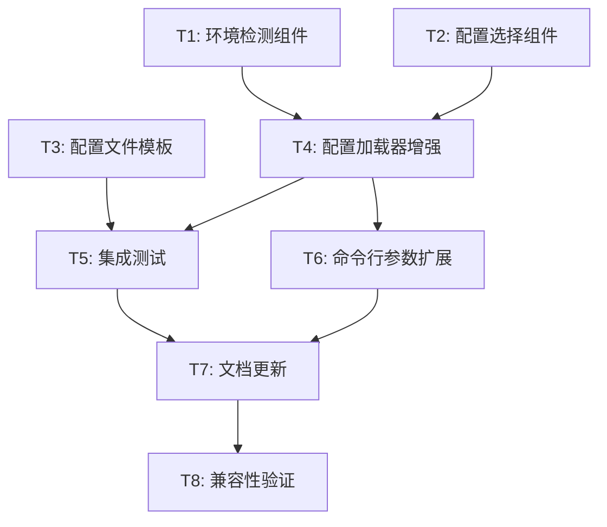

# 多环境配置系统 - Atomize阶段任务拆分

## 任务依赖关系图

## 原子任务列表

### T1: 环境检测组件实现

**任务描述**：实现多种环境检测策略的组件

**输入契约**：
- 前置依赖：无
- 输入数据：命令行参数、环境变量、文件系统状态
- 环境依赖：Go开发环境

**输出契约**：
- 输出数据：环境检测结果（dev/test/prod）
- 交付物：
  - `internal/config/environment.go` - 环境检测接口和实现
  - `internal/config/environment_test.go` - 单元测试
- 验收标准：
  - 支持4种检测策略（命令行、环境变量、文件存在性、运行环境）
  - 按置信度排序返回最佳匹配
  - 单元测试覆盖率 > 90%
  - 所有边界条件测试通过

**实现约束**：
- 技术栈：Go 1.19+
- 接口规范：实现EnvironmentDetector接口
- 质量要求：无外部依赖，纯函数设计

**依赖关系**：
- 后置任务：T4 (配置加载器增强)
- 并行任务：T2, T3

---

### T2: 配置选择组件实现

**任务描述**：实现根据环境选择配置文件的组件

**输入契约**：
- 前置依赖：无
- 输入数据：配置文件路径、环境标识、搜索路径列表
- 环境依赖：Go开发环境、文件系统访问

**输出契约**：
- 输出数据：选中的配置文件路径
- 交付物：
  - `internal/config/selector.go` - 配置选择器实现
  - `internal/config/selector_test.go` - 单元测试
- 验收标准：
  - 支持配置文件优先级选择
  - 支持多路径搜索
  - 文件不存在时的降级策略
  - 单元测试覆盖率 > 90%

**实现约束**：
- 技术栈：Go标准库（filepath, os）
- 接口规范：实现ConfigSelector接口
- 质量要求：错误处理完善，路径处理安全

**依赖关系**：
- 后置任务：T4 (配置加载器增强)
- 并行任务：T1, T3

---

### T3: 配置文件模板创建

**任务描述**：创建各环境的配置文件模板和示例

**输入契约**：
- 前置依赖：无
- 输入数据：现有config.yml结构、各环境特定需求
- 环境依赖：YAML编辑器

**输出契约**：
- 输出数据：标准化的环境配置模板
- 交付物：
  - `configs/config-dev.yml.example` - 开发环境配置模板
  - `configs/config-test.yml.example` - 测试环境配置模板
  - `configs/config-prod.yml.example` - 生产环境配置模板
  - `configs/README.md` - 配置文件说明文档
- 验收标准：
  - 每个模板都是完整可用的配置
  - 包含环境特定的优化配置
  - 包含详细的注释说明
  - 通过YAML语法验证

**实现约束**：
- 技术栈：YAML格式
- 接口规范：与现有Config结构体完全兼容
- 质量要求：配置合理性验证，注释完整

**依赖关系**：
- 后置任务：T5 (集成测试)
- 并行任务：T1, T2

---

### T4: 配置加载器增强

**任务描述**：增强现有配置加载器，集成环境检测和配置选择功能

**输入契约**：
- 前置依赖：T1 (环境检测组件), T2 (配置选择组件)
- 输入数据：现有config.go代码、新的组件接口
- 环境依赖：Go开发环境、viper库

**输出契约**：
- 输出数据：增强的配置加载功能
- 交付物：
  - 修改 `internal/config/config.go` - 增强Load函数
  - 新增 `internal/config/loader.go` - 配置加载器实现
  - 更新 `internal/config/config_test.go` - 测试用例
- 验收标准：
  - 保持现有Load函数接口不变
  - 支持环境自动检测和配置选择
  - 所有现有测试继续通过
  - 新功能测试覆盖率 > 90%
  - 性能不下降超过10%

**实现约束**：
- 技术栈：Go 1.19+, viper库
- 接口规范：保持向后兼容
- 质量要求：错误处理完善，日志记录详细

**依赖关系**：
- 前置任务：T1, T2
- 后置任务：T5 (集成测试), T6 (命令行参数扩展)

---

### T5: 集成测试实现

**任务描述**：实现端到端的多环境配置加载测试

**输入契约**：
- 前置依赖：T3 (配置文件模板), T4 (配置加载器增强)
- 输入数据：配置模板文件、增强的加载器
- 环境依赖：Go测试环境、临时文件系统

**输出契约**：
- 输出数据：完整的测试覆盖
- 交付物：
  - `internal/config/integration_test.go` - 集成测试
  - `test/config_integration_test.sh` - Shell集成测试脚本
- 验收标准：
  - 测试所有环境检测场景
  - 测试所有配置选择场景
  - 测试环境变量覆盖功能
  - 测试错误处理和降级策略
  - 测试性能基准

**实现约束**：
- 技术栈：Go testing包、Shell脚本
- 接口规范：遵循Go测试约定
- 质量要求：测试独立性，清理临时文件

**依赖关系**：
- 前置任务：T3, T4
- 后置任务：T7 (文档更新)
- 并行任务：T6

---

### T6: 命令行参数扩展

**任务描述**：扩展命令行工具支持环境参数

**输入契约**：
- 前置依赖：T4 (配置加载器增强)
- 输入数据：现有cmd/main.go代码、增强的配置加载器
- 环境依赖：Go开发环境

**输出契约**：
- 输出数据：支持环境参数的命令行工具
- 交付物：
  - 修改 `cmd/main.go` - 添加-env参数支持
  - 更新 `cmd/main_test.go` - 测试用例
- 验收标准：
  - 支持 `-env=dev/test/prod` 参数
  - 参数验证和错误提示
  - 帮助信息更新
  - 向后兼容性保证

**实现约束**：
- 技术栈：Go flag包
- 接口规范：保持现有参数不变
- 质量要求：参数验证，错误提示友好

**依赖关系**：
- 前置任务：T4
- 后置任务：T7 (文档更新)
- 并行任务：T5

---

### T7: 文档更新

**任务描述**：更新项目文档，说明多环境配置功能

**输入契约**：
- 前置依赖：T5 (集成测试), T6 (命令行参数扩展)
- 输入数据：现有文档、新功能实现
- 环境依赖：Markdown编辑器

**输出契约**：
- 输出数据：完整的功能文档
- 交付物：
  - 更新 `README.md` - 添加多环境配置说明
  - 更新 `USAGE_GUIDE.md` - 添加使用示例
  - 新增 `docs/MULTI_ENV_CONFIG.md` - 详细配置指南
  - 更新 `configs/README.md` - 配置文件说明
- 验收标准：
  - 文档结构清晰，内容完整
  - 包含使用示例和最佳实践
  - 包含故障排除指南
  - 文档格式规范，链接有效

**实现约束**：
- 技术栈：Markdown
- 接口规范：遵循项目文档规范
- 质量要求：内容准确，示例可执行

**依赖关系**：
- 前置任务：T5, T6
- 后置任务：T8 (兼容性验证)

---

### T8: 兼容性验证

**任务描述**：验证新功能的向后兼容性和系统集成

**输入契约**：
- 前置依赖：T7 (文档更新)
- 输入数据：完整的新功能实现、现有系统
- 环境依赖：完整的项目环境

**输出契约**：
- 输出数据：兼容性验证报告
- 交付物：
  - `test/compatibility_verification.sh` - 兼容性测试脚本
  - `docs/multi-env-config/COMPATIBILITY_REPORT.md` - 兼容性报告
- 验收标准：
  - 所有现有脚本正常工作
  - 所有现有测试通过
  - 性能基准测试通过
  - 部署流程验证通过

**实现约束**：
- 技术栈：Shell脚本、Go测试
- 接口规范：不破坏现有接口
- 质量要求：全面覆盖，结果可信

**依赖关系**：
- 前置任务：T7
- 后置任务：无（最终任务）

## 任务执行计划

### 第一阶段：基础组件开发（并行）
- **T1**: 环境检测组件实现 (预计2小时)
- **T2**: 配置选择组件实现 (预计2小时)
- **T3**: 配置文件模板创建 (预计1小时)

### 第二阶段：核心功能集成
- **T4**: 配置加载器增强 (预计3小时，依赖T1、T2)

### 第三阶段：测试和扩展（并行）
- **T5**: 集成测试实现 (预计2小时，依赖T3、T4)
- **T6**: 命令行参数扩展 (预计1小时，依赖T4)

### 第四阶段：文档和验证
- **T7**: 文档更新 (预计1.5小时，依赖T5、T6)
- **T8**: 兼容性验证 (预计1小时，依赖T7)

**总预计时间**: 13.5小时

## 风险评估和缓解策略

### 高风险任务
1. **T4 (配置加载器增强)**
   - 风险：可能破坏现有功能
   - 缓解：充分的单元测试，渐进式修改

2. **T8 (兼容性验证)**
   - 风险：发现兼容性问题需要返工
   - 缓解：每个阶段都进行兼容性检查

### 中风险任务
1. **T5 (集成测试)**
   - 风险：测试环境搭建复杂
   - 缓解：使用临时目录，测试隔离

### 低风险任务
- T1, T2, T3, T6, T7：相对独立，风险较低

## 质量门控

### 每个任务完成标准
1. ✅ 代码实现完成
2. ✅ 单元测试通过（覆盖率 > 90%）
3. ✅ 代码审查通过
4. ✅ 文档更新完成
5. ✅ 集成测试通过

### 阶段完成标准
1. ✅ 所有任务验收标准满足
2. ✅ 性能基准测试通过
3. ✅ 兼容性测试通过
4. ✅ 文档完整性检查通过

## 交付物清单

### 代码文件
- `internal/config/environment.go` - 环境检测组件
- `internal/config/selector.go` - 配置选择组件
- `internal/config/loader.go` - 配置加载器
- 修改 `internal/config/config.go` - 主配置文件
- 修改 `cmd/main.go` - 命令行工具

### 配置文件
- `configs/config-dev.yml.example`
- `configs/config-test.yml.example`
- `configs/config-prod.yml.example`
- `configs/README.md`

### 测试文件
- `internal/config/environment_test.go`
- `internal/config/selector_test.go`
- `internal/config/integration_test.go`
- `test/config_integration_test.sh`
- `test/compatibility_verification.sh`

### 文档文件
- 更新 `README.md`
- 更新 `USAGE_GUIDE.md`
- 新增 `docs/MULTI_ENV_CONFIG.md`
- `docs/multi-env-config/COMPATIBILITY_REPORT.md`

---

**任务拆分原则**：
- **原子性**：每个任务可独立完成和验证
- **可测试性**：每个任务都有明确的验收标准
- **依赖最小化**：减少任务间的强依赖关系
- **风险可控**：高风险任务有明确的缓解策略

**文档状态**: ✅ Atomize阶段完成  
**下一阶段**: Approve - 方案确认  
**更新时间**: 2025-01-15