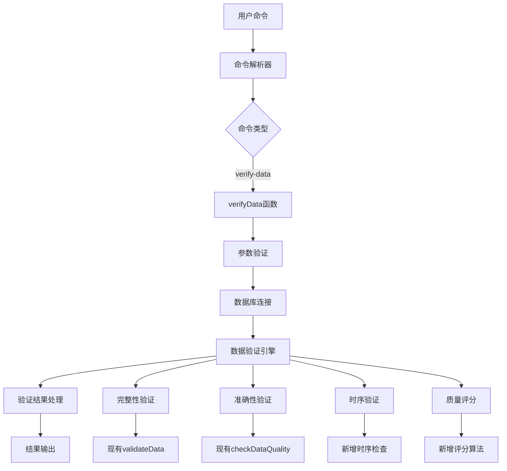
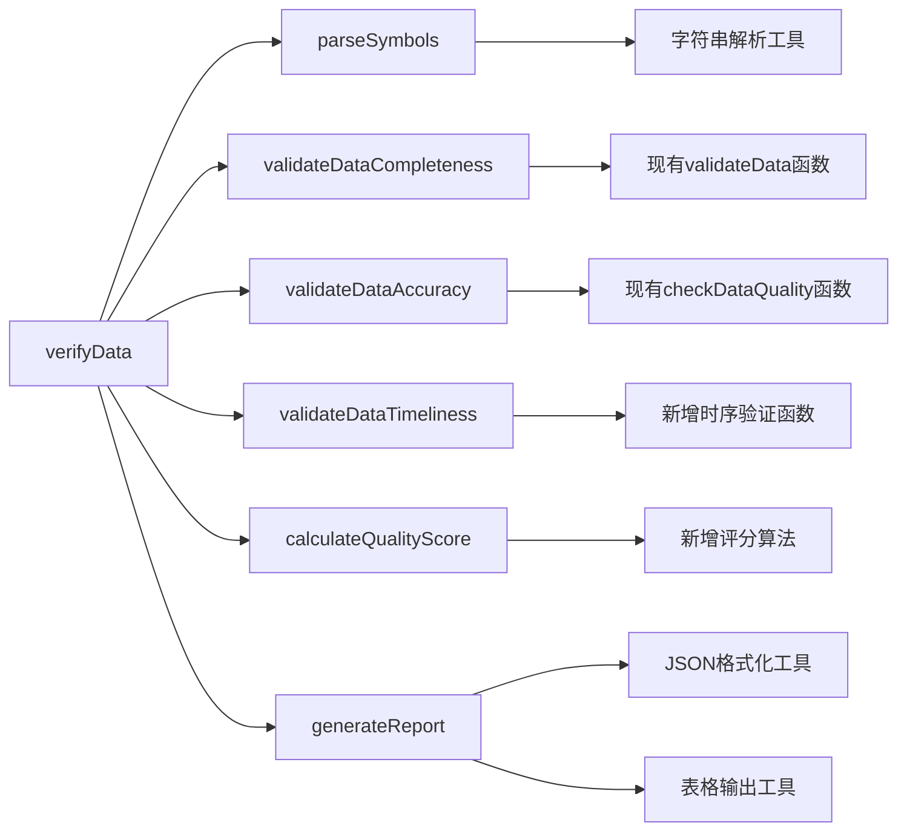
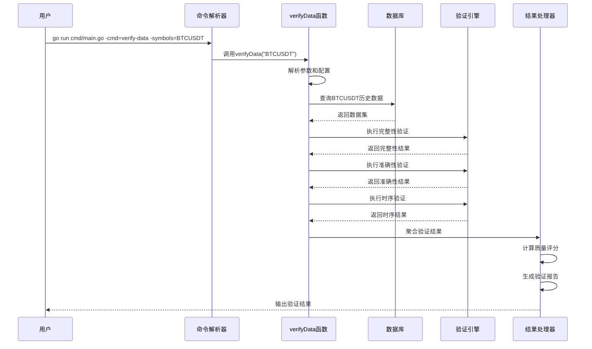
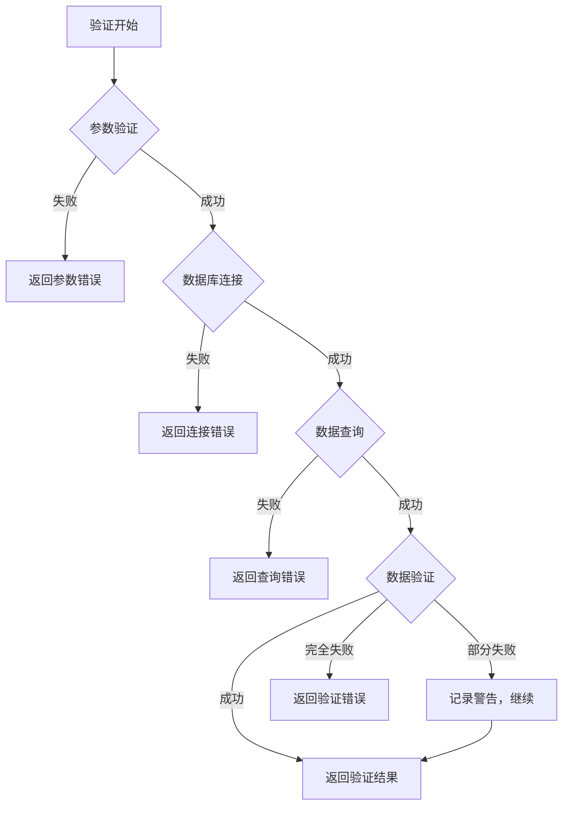

# Data4BT verify-data 命令实现 - 架构设计文档

## 1. 整体架构设计

### 1.1 系统架构图



### 1.2 分层设计

#### 1.2.1 命令层 (Command Layer)
- **职责**: 命令解析和路由
- **组件**: `executeCommand` 函数中的新 case
- **输入**: 命令行参数 `-cmd=verify-data -symbols=BTCUSDT`
- **输出**: 调用验证引擎

#### 1.2.2 验证引擎层 (Validation Engine Layer)
- **职责**: 核心验证逻辑
- **组件**: `verifyData` 函数
- **功能**: 整合多种验证方法，提供统一接口

#### 1.2.3 数据访问层 (Data Access Layer)
- **职责**: 数据库查询和数据获取
- **组件**: 复用现有数据库连接和查询函数
- **功能**: 获取指定交易对的历史数据

#### 1.2.4 结果处理层 (Result Processing Layer)
- **职责**: 验证结果的格式化和输出
- **组件**: 结果聚合器和格式化器
- **功能**: 生成详细的验证报告

## 2. 核心组件设计

### 2.1 verifyData 函数设计

```go
// VerifyDataConfig 验证配置
type VerifyDataConfig struct {
    Symbols    []string  // 交易对列表
    StartTime  time.Time // 验证开始时间
    EndTime    time.Time // 验证结束时间
    Detailed   bool      // 是否输出详细信息
}

// VerifyResult 验证结果
type VerifyResult struct {
    Symbol           string    `json:"symbol"`
    TotalRecords     int64     `json:"total_records"`
    ValidRecords     int64     `json:"valid_records"`
    InvalidRecords   int64     `json:"invalid_records"`
    CompletenessScore float64  `json:"completeness_score"`
    AccuracyScore    float64   `json:"accuracy_score"`
    TimelinessScore  float64   `json:"timeliness_score"`
    OverallScore     float64   `json:"overall_score"`
    Issues           []string  `json:"issues"`
    Recommendations []string  `json:"recommendations"`
    VerifiedAt       time.Time `json:"verified_at"`
}

// verifyData 主验证函数
func verifyData(config VerifyDataConfig) (*VerifyResult, error)
```

### 2.2 模块依赖关系图



## 3. 接口契约定义

### 3.1 命令行接口

```bash
# 基本用法
go run cmd/main.go -cmd=verify-data -symbols=BTCUSDT

# 多个交易对
go run cmd/main.go -cmd=verify-data -symbols=BTCUSDT,ETHUSDT,ADAUSDT

# 指定时间范围
go run cmd/main.go -cmd=verify-data -symbols=BTCUSDT -start=2024-01-01 -end=2024-01-31

# 详细模式
go run cmd/main.go -cmd=verify-data -symbols=BTCUSDT -detailed=true
```

### 3.2 函数接口

```go
// 主验证函数接口
func verifyData(symbols string, startTime, endTime *time.Time, detailed bool) error

// 辅助函数接口
func parseSymbolsParameter(symbols string) ([]string, error)
func validateSymbolData(symbol string, start, end time.Time) (*VerifyResult, error)
func aggregateResults(results []*VerifyResult) *AggregatedResult
func formatVerificationReport(results []*VerifyResult, detailed bool) string
```

### 3.3 数据接口

```go
// 数据查询接口
type DataQuery struct {
    Symbol    string
    StartTime time.Time
    EndTime   time.Time
    Interval  string
}

// 数据记录接口
type KlineRecord struct {
    Symbol    string    `json:"symbol"`
    OpenTime  time.Time `json:"open_time"`
    CloseTime time.Time `json:"close_time"`
    Open      float64   `json:"open"`
    High      float64   `json:"high"`
    Low       float64   `json:"low"`
    Close     float64   `json:"close"`
    Volume    float64   `json:"volume"`
}
```

## 4. 数据流向图



## 5. 验证算法设计

### 5.1 完整性验证算法

```go
// 数据完整性验证
func validateCompleteness(symbol string, start, end time.Time) (float64, []string) {
    // 1. 计算期望的数据点数量
    expectedCount := calculateExpectedDataPoints(start, end, "1m")
    
    // 2. 查询实际数据点数量
    actualCount := queryActualDataPoints(symbol, start, end)
    
    // 3. 计算完整性评分
    completenessScore := float64(actualCount) / float64(expectedCount) * 100
    
    // 4. 识别缺失的时间段
    missingPeriods := findMissingDataPeriods(symbol, start, end)
    
    return completenessScore, missingPeriods
}
```

### 5.2 准确性验证算法

```go
// 数据准确性验证
func validateAccuracy(records []KlineRecord) (float64, []string) {
    var issues []string
    validCount := 0
    
    for _, record := range records {
        // 1. 价格范围验证
        if record.High < record.Low {
            issues = append(issues, fmt.Sprintf("Invalid price range at %v", record.OpenTime))
            continue
        }
        
        // 2. OHLC逻辑验证
        if record.Open > record.High || record.Open < record.Low ||
           record.Close > record.High || record.Close < record.Low {
            issues = append(issues, fmt.Sprintf("Invalid OHLC values at %v", record.OpenTime))
            continue
        }
        
        // 3. 成交量验证
        if record.Volume < 0 {
            issues = append(issues, fmt.Sprintf("Negative volume at %v", record.OpenTime))
            continue
        }
        
        validCount++
    }
    
    accuracyScore := float64(validCount) / float64(len(records)) * 100
    return accuracyScore, issues
}
```

### 5.3 时序验证算法

```go
// 时序连续性验证
func validateTimeliness(records []KlineRecord) (float64, []string) {
    if len(records) < 2 {
        return 100.0, nil
    }
    
    var issues []string
    expectedInterval := time.Minute // 1分钟K线
    validIntervals := 0
    
    for i := 1; i < len(records); i {
        actualInterval := records[i].OpenTime.Sub(records[i-1].OpenTime)
        if actualInterval != expectedInterval {
            issues = append(issues, fmt.Sprintf("Time gap detected: %v to %v", 
                records[i-1].OpenTime, records[i].OpenTime))
        } else {
            validIntervals++
        }
    }
    
    timelinessScore := float64(validIntervals) / float64(len(records)-1) * 100
    return timelinessScore, issues
}
```

## 6. 异常处理策略

### 6.1 错误分类

```go
// 错误类型定义
type VerificationError struct {
    Type    string `json:"type"`
    Code    string `json:"code"`
    Message string `json:"message"`
    Symbol  string `json:"symbol,omitempty"`
}

// 错误类型常量
const (
    ErrorTypeInvalidSymbol   = "INVALID_SYMBOL"
    ErrorTypeDataNotFound    = "DATA_NOT_FOUND"
    ErrorTypeDatabaseError   = "DATABASE_ERROR"
    ErrorTypeValidationError = "VALIDATION_ERROR"
)
```

### 6.2 错误处理流程



### 6.3 容错机制

1. **参数容错**: 自动修正常见的参数格式错误
2. **数据容错**: 跳过损坏的数据记录，继续验证其他数据
3. **网络容错**: 实现重试机制，处理临时网络问题
4. **资源容错**: 监控内存使用，防止大数据集导致的内存溢出

## 7. 性能优化设计

### 7.1 查询优化

```sql
-- 优化的数据查询语句
SELECT 
    symbol,
    open_time,
    close_time,
    open,
    high,
    low,
    close,
    volume
FROM klines 
WHERE symbol = ? 
    AND open_time >= ? 
    AND open_time <= ?
ORDER BY open_time
LIMIT 100000; -- 限制单次查询数量
```

### 7.2 内存优化

```go
// 分批处理大数据集
func verifyLargeDataset(symbol string, start, end time.Time) (*VerifyResult, error) {
    batchSize := 10000
    currentTime := start
    
    var aggregatedResult VerifyResult
    
    for currentTime.Before(end) {
        batchEnd := currentTime.Add(time.Hour * 24) // 每批处理一天的数据
        if batchEnd.After(end) {
            batchEnd = end
        }
        
        batchResult, err := verifyBatch(symbol, currentTime, batchEnd, batchSize)
        if err != nil {
            return nil, err
        }
        
        // 聚合批次结果
        aggregateResults(&aggregatedResult, batchResult)
        
        currentTime = batchEnd
    }
    
    return &aggregatedResult, nil
}
```

### 7.3 并发处理

```go
// 并发验证多个交易对
func verifyMultipleSymbols(symbols []string, start, end time.Time) ([]*VerifyResult, error) {
    resultChan := make(chan *VerifyResult, len(symbols))
    errorChan := make(chan error, len(symbols))
    
    // 限制并发数量
    semaphore := make(chan struct{}, 5)
    
    for _, symbol := range symbols {
        go func(sym string) {
            semaphore <- struct{}{} // 获取信号量
            defer func() { <-semaphore }() // 释放信号量
            
            result, err := validateSymbolData(sym, start, end)
            if err != nil {
                errorChan <- err
                return
            }
            resultChan <- result
        }(symbol)
    }
    
    // 收集结果
    var results []*VerifyResult
    var errors []error
    
    for i := 0; i < len(symbols); i++ {
        select {
        case result := <-resultChan:
            results = append(results, result)
        case err := <-errorChan:
            errors = append(errors, err)
        }
    }
    
    if len(errors) > 0 {
        return results, fmt.Errorf("验证过程中发生 %d 个错误", len(errors))
    }
    
    return results, nil
}
```

## 8. 输出格式设计

### 8.1 简洁模式输出

```
✅ BTCUSDT 数据验证完成
📊 验证统计:
   - 总记录数: 1,440
   - 有效记录: 1,438
   - 完整性评分: 99.86%
   - 准确性评分: 99.93%
   - 时序性评分: 100.00%
   - 综合评分: 99.93% (优秀)

⚠️  发现 2 个问题:
   - 2024-01-15 14:23:00 价格异常
   - 2024-01-20 09:15:00 数据缺失

💡 建议:
   - 检查数据源在异常时间点的状态
   - 考虑补充缺失的数据点
```

### 8.2 详细模式输出

```json
{
  "verification_summary": {
    "total_symbols": 1,
    "verified_at": "2024-01-25T10:30:00Z",
    "overall_score": 99.93
  },
  "results": [
    {
      "symbol": "BTCUSDT",
      "total_records": 1440,
      "valid_records": 1438,
      "invalid_records": 2,
      "completeness_score": 99.86,
      "accuracy_score": 99.93,
      "timeliness_score": 100.00,
      "overall_score": 99.93,
      "issues": [
        "Price anomaly detected at 2024-01-15T14:23:00Z",
        "Missing data point at 2024-01-20T09:15:00Z"
      ],
      "recommendations": [
        "Check data source status during anomaly periods",
        "Consider filling missing data points"
      ],
      "verified_at": "2024-01-25T10:30:00Z"
    }
  ]
}
```

## 9. 集成方案

### 9.1 与现有系统集成

```go
// 在 executeCommand 函数中添加新的 case
case "verify-data":
    symbols := getStringFlag("symbols", "")
    if symbols == "" {
        return fmt.Errorf("symbols parameter is required")
    }
    
    startTime := getTimeFlag("start", nil)
    endTime := getTimeFlag("end", nil)
    detailed := getBoolFlag("detailed", false)
    
    return verifyData(symbols, startTime, endTime, detailed)
```

### 9.2 复用现有组件

```go
// 复用现有的数据库连接
func verifyData(symbols string, startTime, endTime *time.Time, detailed bool) error {
    // 复用现有的数据库连接逻辑
    db, err := getDatabase()
    if err != nil {
        return fmt.Errorf("failed to connect to database: %w", err)
    }
    defer db.Close()
    
    // 复用现有的日志系统
    logger := getLogger()
    logger.Info("Starting data verification", "symbols", symbols)
    
    // 实现验证逻辑...
    return nil
}
```

## 10. 质量保证

### 10.1 单元测试设计

```go
// 测试用例设计
func TestVerifyData(t *testing.T) {
    tests := []struct {
        name     string
        symbols  string
        expected error
    }{
        {"valid single symbol", "BTCUSDT", nil},
        {"valid multiple symbols", "BTCUSDT,ETHUSDT", nil},
        {"invalid symbol", "INVALID", ErrInvalidSymbol},
        {"empty symbols", "", ErrEmptySymbols},
    }
    
    for _, tt := range tests {
        t.Run(tt.name, func(t *testing.T) {
            err := verifyData(tt.symbols, nil, nil, false)
            assert.Equal(t, tt.expected, err)
        })
    }
}
```

### 10.2 集成测试设计

```bash
#!/bin/bash
# 集成测试脚本

# 测试基本功能
go run cmd/main.go -cmd=verify-data -symbols=BTCUSDT

# 测试多交易对
go run cmd/main.go -cmd=verify-data -symbols=BTCUSDT,ETHUSDT

# 测试详细模式
go run cmd/main.go -cmd=verify-data -symbols=BTCUSDT -detailed=true

# 测试错误处理
go run cmd/main.go -cmd=verify-data -symbols=INVALID
```

---

**设计结论**: 本设计方案在现有架构基础上，通过添加新的 `verify-data` 命令和相应的验证逻辑，为用户提供专门的数据验证功能。设计充分考虑了性能、可维护性和用户体验，确保与现有系统的无缝集成。