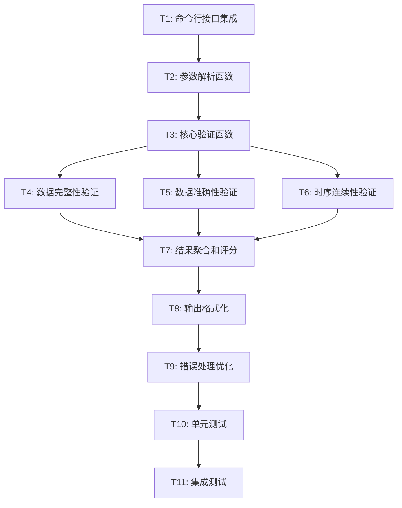

# Data4BT verify-data 命令实现 - 任务拆分文档

## 1. 任务概述

基于DESIGN文档，将verify-data命令的实现拆分为以下原子化任务，确保每个任务都可以独立开发、测试和验证。

## 2. 任务依赖关系图



## 3. 原子任务详细定义

### T1: 命令行接口集成

#### 输入契约
- **前置依赖**: 现有的 `cmd/main.go` 文件
- **输入数据**: 现有的 `executeCommand` 函数结构
- **环境依赖**: Go开发环境，现有项目结构

#### 输出契约
- **输出数据**: 在 `executeCommand` 函数中添加 `verify-data` case
- **交付物**: 修改后的 `cmd/main.go` 文件
- **验收标准**: 
  - 编译通过
  - `go run cmd/main.go -cmd=verify-data` 能被正确识别
  - 不破坏现有命令功能

#### 实现约束
- **技术栈**: Go语言
- **接口规范**: 遵循现有命令的参数解析模式
- **质量要求**: 代码风格与现有代码一致

#### 依赖关系
- **后置任务**: T2 (参数解析函数)
- **并行任务**: 无

---

### T2: 参数解析函数

#### 输入契约
- **前置依赖**: T1完成
- **输入数据**: 命令行参数 `-symbols`, `-start`, `-end`, `-detailed`
- **环境依赖**: 现有的参数解析工具函数

#### 输出契约
- **输出数据**: `parseVerifyDataParams` 函数
- **交付物**: 参数解析和验证逻辑
- **验收标准**:
  - 正确解析单个交易对: `BTCUSDT`
  - 正确解析多个交易对: `BTCUSDT,ETHUSDT`
  - 正确处理可选的时间参数
  - 参数验证错误时返回清晰的错误信息

#### 实现约束
- **技术栈**: Go语言
- **接口规范**: 
  ```go
  func parseVerifyDataParams() ([]string, *time.Time, *time.Time, bool, error)
  ```
- **质量要求**: 包含输入验证和错误处理

#### 依赖关系
- **前置任务**: T1
- **后置任务**: T3 (核心验证函数)
- **并行任务**: 无

---

### T3: 核心验证函数

#### 输入契约
- **前置依赖**: T2完成
- **输入数据**: 解析后的参数（交易对列表、时间范围、详细模式标志）
- **环境依赖**: 数据库连接，现有的日志系统

#### 输出契约
- **输出数据**: `verifyData` 主函数
- **交付物**: 验证流程控制逻辑
- **验收标准**:
  - 能够协调调用各个验证子模块
  - 正确处理单个和多个交易对
  - 实现并发验证多个交易对
  - 提供进度反馈

#### 实现约束
- **技术栈**: Go语言，goroutines用于并发
- **接口规范**:
  ```go
  func verifyData(symbols []string, start, end *time.Time, detailed bool) error
  ```
- **质量要求**: 支持并发处理，包含错误恢复机制

#### 依赖关系
- **前置任务**: T2
- **后置任务**: T4, T5, T6 (各验证模块)
- **并行任务**: 无

---

### T4: 数据完整性验证

#### 输入契约
- **前置依赖**: T3完成
- **输入数据**: 交易对名称，时间范围
- **环境依赖**: 数据库连接，现有的数据查询函数

#### 输出契约
- **输出数据**: `validateCompleteness` 函数
- **交付物**: 完整性验证逻辑
- **验收标准**:
  - 计算期望的数据点数量
  - 查询实际数据点数量
  - 计算完整性评分 (0-100)
  - 识别缺失的时间段

#### 实现约束
- **技术栈**: Go语言，ClickHouse查询
- **接口规范**:
  ```go
  func validateCompleteness(symbol string, start, end time.Time) (float64, []string, error)
  ```
- **质量要求**: 高效的数据库查询，准确的缺失数据检测

#### 依赖关系
- **前置任务**: T3
- **后置任务**: T7 (结果聚合)
- **并行任务**: T5, T6

---

### T5: 数据准确性验证

#### 输入契约
- **前置依赖**: T3完成
- **输入数据**: K线数据记录集合
- **环境依赖**: 现有的数据质量检查函数

#### 输出契约
- **输出数据**: `validateAccuracy` 函数
- **交付物**: 准确性验证逻辑
- **验收标准**:
  - 验证OHLC价格逻辑关系
  - 检查价格范围合理性
  - 验证成交量非负性
  - 计算准确性评分 (0-100)
  - 记录具体的数据异常

#### 实现约束
- **技术栈**: Go语言
- **接口规范**:
  ```go
  func validateAccuracy(records []KlineRecord) (float64, []string, error)
  ```
- **质量要求**: 复用现有的 `checkDataQuality` 逻辑

#### 依赖关系
- **前置任务**: T3
- **后置任务**: T7 (结果聚合)
- **并行任务**: T4, T6

---

### T6: 时序连续性验证

#### 输入契约
- **前置依赖**: T3完成
- **输入数据**: 按时间排序的K线数据记录
- **环境依赖**: 时间处理工具

#### 输出契约
- **输出数据**: `validateTimeliness` 函数
- **交付物**: 时序验证逻辑
- **验收标准**:
  - 检查数据时间间隔的一致性
  - 识别时间跳跃和重复
  - 计算时序性评分 (0-100)
  - 记录时间异常的具体位置

#### 实现约束
- **技术栈**: Go语言，time包
- **接口规范**:
  ```go
  func validateTimeliness(records []KlineRecord) (float64, []string, error)
  ```
- **质量要求**: 精确的时间计算，高效的序列处理

#### 依赖关系
- **前置任务**: T3
- **后置任务**: T7 (结果聚合)
- **并行任务**: T4, T5

---

### T7: 结果聚合和评分

#### 输入契约
- **前置依赖**: T4, T5, T6完成
- **输入数据**: 各个验证模块的结果
- **环境依赖**: 数学计算工具

#### 输出契约
- **输出数据**: `aggregateResults` 和 `calculateOverallScore` 函数
- **交付物**: 结果聚合逻辑和综合评分算法
- **验收标准**:
  - 合并各模块的验证结果
  - 计算加权综合评分
  - 生成问题汇总和建议
  - 支持多交易对结果聚合

#### 实现约束
- **技术栈**: Go语言
- **接口规范**:
  ```go
  func aggregateResults(completeness, accuracy, timeliness float64, issues []string) *VerifyResult
  func calculateOverallScore(completeness, accuracy, timeliness float64) float64
  ```
- **质量要求**: 合理的权重分配，清晰的评分逻辑

#### 依赖关系
- **前置任务**: T4, T5, T6
- **后置任务**: T8 (输出格式化)
- **并行任务**: 无

---

### T8: 输出格式化

#### 输入契约
- **前置依赖**: T7完成
- **输入数据**: 聚合后的验证结果
- **环境依赖**: JSON编码工具，表格输出工具

#### 输出契约
- **输出数据**: `formatOutput` 函数
- **交付物**: 多种格式的输出逻辑
- **验收标准**:
  - 简洁模式：用户友好的摘要输出
  - 详细模式：完整的JSON格式输出
  - 支持彩色输出和图标
  - 清晰的问题和建议展示

#### 实现约束
- **技术栈**: Go语言，JSON包，终端颜色库
- **接口规范**:
  ```go
  func formatOutput(results []*VerifyResult, detailed bool) string
  ```
- **质量要求**: 美观的输出格式，良好的可读性

#### 依赖关系
- **前置任务**: T7
- **后置任务**: T9 (错误处理)
- **并行任务**: 无

---

### T9: 错误处理优化

#### 输入契约
- **前置依赖**: T1-T8完成
- **输入数据**: 现有的错误处理代码
- **环境依赖**: Go错误处理最佳实践

#### 输出契约
- **输出数据**: 完善的错误处理机制
- **交付物**: 错误类型定义，错误处理函数
- **验收标准**:
  - 定义清晰的错误类型和错误码
  - 实现优雅的错误恢复机制
  - 提供有用的错误信息和建议
  - 确保部分失败时的容错处理

#### 实现约束
- **技术栈**: Go语言错误处理
- **接口规范**:
  ```go
  type VerificationError struct {
      Type    string
      Code    string
      Message string
      Symbol  string
  }
  ```
- **质量要求**: 遵循Go错误处理惯例，提供上下文信息

#### 依赖关系
- **前置任务**: T1-T8
- **后置任务**: T10 (单元测试)
- **并行任务**: 无

---

### T10: 单元测试

#### 输入契约
- **前置依赖**: T1-T9完成
- **输入数据**: 所有实现的函数
- **环境依赖**: Go测试框架，测试数据

#### 输出契约
- **输出数据**: 完整的单元测试套件
- **交付物**: `*_test.go` 文件
- **验收标准**:
  - 测试覆盖率 > 90%
  - 包含正常流程和异常流程测试
  - 包含边界条件测试
  - 所有测试用例通过

#### 实现约束
- **技术栈**: Go testing包，testify库
- **接口规范**: 标准Go测试函数
- **质量要求**: 高质量的测试用例，清晰的测试文档

#### 依赖关系
- **前置任务**: T1-T9
- **后置任务**: T11 (集成测试)
- **并行任务**: 无

---

### T11: 集成测试

#### 输入契约
- **前置依赖**: T1-T10完成
- **输入数据**: 完整的verify-data命令实现
- **环境依赖**: 测试数据库，测试数据

#### 输出契约
- **输出数据**: 集成测试脚本和测试报告
- **交付物**: 端到端测试验证
- **验收标准**:
  - 命令行接口完全可用
  - 各种参数组合正常工作
  - 错误场景正确处理
  - 性能满足要求

#### 实现约束
- **技术栈**: Bash脚本，Go程序
- **接口规范**: 标准命令行接口
- **质量要求**: 全面的场景覆盖，自动化测试

#### 依赖关系
- **前置任务**: T1-T10
- **后置任务**: 无
- **并行任务**: 无

## 4. 任务优先级和时间估算

| 任务ID | 任务名称 | 优先级 | 估算时间 | 复杂度 |
|--------|----------|--------|----------|--------|
| T1 | 命令行接口集成 | 高 | 30分钟 | 低 |
| T2 | 参数解析函数 | 高 | 45分钟 | 中 |
| T3 | 核心验证函数 | 高 | 60分钟 | 中 |
| T4 | 数据完整性验证 | 中 | 90分钟 | 高 |
| T5 | 数据准确性验证 | 中 | 75分钟 | 中 |
| T6 | 时序连续性验证 | 中 | 60分钟 | 中 |
| T7 | 结果聚合和评分 | 中 | 45分钟 | 中 |
| T8 | 输出格式化 | 低 | 60分钟 | 中 |
| T9 | 错误处理优化 | 中 | 30分钟 | 低 |
| T10 | 单元测试 | 高 | 120分钟 | 高 |
| T11 | 集成测试 | 高 | 60分钟 | 中 |

**总估算时间**: 约 10.5 小时

## 5. 风险评估

### 5.1 技术风险
- **数据库性能**: 大数据量查询可能影响性能
- **内存使用**: 处理大数据集时的内存管理
- **并发安全**: 多goroutine访问共享资源

### 5.2 集成风险
- **现有代码兼容性**: 确保不破坏现有功能
- **参数解析一致性**: 与现有命令保持一致
- **错误处理统一性**: 遵循现有错误处理模式

### 5.3 缓解策略
- 分批处理大数据集
- 使用内存池和对象复用
- 实现适当的同步机制
- 充分的单元测试和集成测试

## 6. 质量门控

### 6.1 代码质量
- [ ] 代码风格与现有项目一致
- [ ] 函数复杂度控制在合理范围
- [ ] 充分的注释和文档
- [ ] 无静态分析警告

### 6.2 功能质量
- [ ] 所有验收标准满足
- [ ] 单元测试覆盖率 > 90%
- [ ] 集成测试全部通过
- [ ] 性能满足要求

### 6.3 集成质量
- [ ] 不破坏现有功能
- [ ] 与现有架构无冲突
- [ ] 错误处理一致
- [ ] 日志输出规范

---

**任务拆分结论**: 将verify-data命令实现拆分为11个原子化任务，每个任务都有明确的输入输出契约和验收标准。任务间依赖关系清晰，可以按照依赖顺序逐步实现，确保高质量交付。