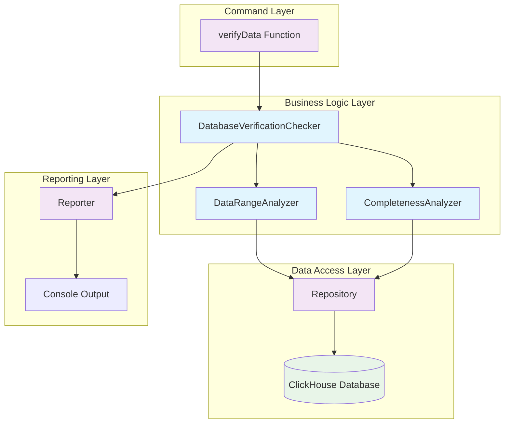
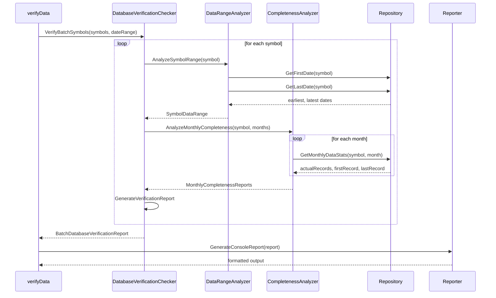

# Architect阶段：基于数据库的数据完整性检查架构设计

## 整体架构图



## 分层设计

### 1. 命令层 (Command Layer)
- **verifyData函数**: 现有函数，需要重构核心逻辑
- **职责**: 参数解析、组件初始化、结果输出

### 2. 业务逻辑层 (Business Logic Layer)

#### DatabaseVerificationChecker (新组件)
```go
type DatabaseVerificationChecker struct {
    repository domain.KLineRepository
    rangeAnalyzer *DataRangeAnalyzer
    completenessAnalyzer *CompletenessAnalyzer
    logger zerolog.Logger
}
```
**职责**: 
- 协调数据范围分析和完整性检查
- 生成综合验证报告
- 替代现有的基于币安API的逻辑

#### DataRangeAnalyzer (新组件)
```go
type DataRangeAnalyzer struct {
    repository domain.KLineRepository
}

type SymbolDataRange struct {
    Symbol      string
    EarliestDate time.Time
    LatestDate   time.Time
    TotalMonths  int
    MonthList    []string
}
```
**职责**:
- 查询数据库获取交易对实际数据范围
- 生成月份列表用于完整性检查

#### CompletenessAnalyzer (新组件)
```go
type CompletenessAnalyzer struct {
    repository domain.KLineRepository
    expectedRecordsCalc ExpectedRecordsCalculator
}

type MonthlyCompletenessReport struct {
    Month             string
    ExpectedRecords   int64
    ActualRecords     int64
    CompletenessRatio float64
    Status            CompletenessStatus
    FirstRecord       time.Time
    LastRecord        time.Time
}
```
**职责**:
- 逐月检查数据完整性
- 计算完整性比例
- 识别缺失和不完整的月份

### 3. 数据访问层 (Data Access Layer)
- **Repository**: 复用现有组件
- **使用的方法**:
  - `GetFirstDate(symbol)`: 获取最早日期
  - `GetLastDate(symbol)`: 获取最新日期
  - `GetMonthlyDataStats(symbol, month)`: 获取月度统计

### 4. 报告层 (Reporting Layer)
- **Reporter**: 复用现有组件
- **输出格式**: 保持与现有格式一致

## 核心组件设计

### DatabaseVerificationChecker接口

```go
type DatabaseVerificationChecker interface {
    // VerifySymbolData 验证单个交易对的数据完整性
    VerifySymbolData(ctx context.Context, symbol string, startDate, endDate *time.Time) (*DatabaseVerificationReport, error)
    
    // VerifyBatchSymbols 批量验证多个交易对
    VerifyBatchSymbols(ctx context.Context, symbols []string, startDate, endDate *time.Time) (*BatchDatabaseVerificationReport, error)
}

type DatabaseVerificationReport struct {
    Symbol                string
    DataRange            *SymbolDataRange
    MonthlyReports       []*MonthlyCompletenessReport
    OverallCompleteness  float64
    MissingMonths        []string
    IncompleteMonths     []string
    QualityScore         float64
    GeneratedAt          time.Time
}

type BatchDatabaseVerificationReport struct {
    Reports             []*DatabaseVerificationReport
    TotalSymbols        int
    VerifiedSymbols     int
    AverageCompleteness float64
    Summary             *VerificationSummary
    GeneratedAt         time.Time
}
```

### DataRangeAnalyzer接口

```go
type DataRangeAnalyzer interface {
    // AnalyzeSymbolRange 分析交易对数据范围
    AnalyzeSymbolRange(ctx context.Context, symbol string) (*SymbolDataRange, error)
    
    // GenerateMonthList 生成指定范围内的月份列表
    GenerateMonthList(startDate, endDate time.Time) []string
    
    // FilterMonthsByDateRange 根据日期范围过滤月份
    FilterMonthsByDateRange(months []string, startDate, endDate *time.Time) []string
}
```

### CompletenessAnalyzer接口

```go
type CompletenessAnalyzer interface {
    // AnalyzeMonthlyCompleteness 分析月度完整性
    AnalyzeMonthlyCompleteness(ctx context.Context, symbol string, months []string) ([]*MonthlyCompletenessReport, error)
    
    // CalculateOverallCompleteness 计算总体完整性
    CalculateOverallCompleteness(monthlyReports []*MonthlyCompletenessReport) float64
    
    // IdentifyMissingMonths 识别缺失月份
    IdentifyMissingMonths(monthlyReports []*MonthlyCompletenessReport) []string
}
```

## 数据流向图



## 接口契约定义

### 输入契约
- **symbols**: 交易对列表（必需）
- **startDate**: 开始日期（可选，用于过滤）
- **endDate**: 结束日期（可选，用于过滤）
- **format**: 输出格式（可选，默认console）

### 输出契约
- **数据范围信息**: 每个交易对的实际数据时间范围
- **月度完整性报告**: 逐月显示完整性状态
- **缺失月份列表**: 明确指出哪些月份缺失
- **质量评分**: 基于完整性计算的综合评分

## 异常处理策略

### 1. 数据库连接异常
- **策略**: 快速失败，返回明确错误信息
- **恢复**: 不进行重试，由上层处理

### 2. 交易对不存在
- **策略**: 记录警告，继续处理其他交易对
- **输出**: 在报告中标记为"无数据"

### 3. 数据查询异常
- **策略**: 记录错误，跳过当前月份
- **输出**: 在月度报告中标记为"查询失败"

### 4. 日期格式错误
- **策略**: 参数验证阶段捕获，返回用户友好错误
- **恢复**: 提供正确格式示例

## 性能优化设计

### 1. 批量查询优化
- 使用Repository现有的批量查询方法
- 避免N+1查询问题

### 2. 内存管理
- 流式处理大量数据
- 及时释放不需要的数据结构

### 3. 并发处理
- 不同交易对的分析可以并行处理
- 使用goroutine pool控制并发数

## 与现有系统集成

### 1. 复用现有组件
- **Repository**: 完全复用，不需要修改
- **Reporter**: 复用输出格式化逻辑
- **ExpectedRecordsCalculator**: 复用月度记录数计算

### 2. 保持接口兼容
- 命令行参数保持不变
- 输出格式与现有质量检查保持一致
- 错误处理方式保持一致

### 3. 配置管理
- 复用现有的配置系统
- 不引入新的配置项

## 质量门控

### 架构质量检查
✅ **架构图清晰准确**: 组件职责明确，依赖关系清晰  
✅ **接口定义完整**: 所有核心接口都有明确定义  
✅ **与现有系统无冲突**: 复用现有组件，保持兼容性  
✅ **设计可行性验证**: 基于现有Repository方法，技术可行  

### 下一步行动
进入**Atomize阶段**，将架构设计拆分为具体的实现任务。