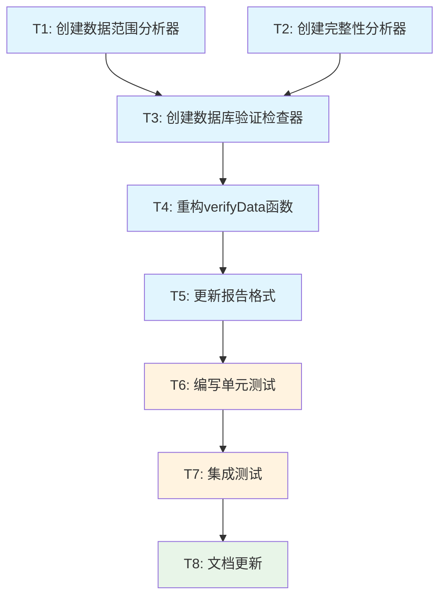

# Atomize阶段：verify-data重构任务分解

## 任务依赖图

## 原子任务详细定义

### T1: 创建数据范围分析器 (DataRangeAnalyzer)

**任务ID**: T1  
**优先级**: 高  
**预估复杂度**: 中等  

#### 输入契约
- **前置依赖**: 无
- **输入数据**: Repository接口
- **环境依赖**: ClickHouse数据库连接

#### 输出契约
- **输出数据**: 
  - `DataRangeAnalyzer`结构体
  - `SymbolDataRange`数据结构
  - 相关接口定义
- **交付物**: 
  - `pkg/verification/range_analyzer.go`
  - `pkg/verification/types.go`
- **验收标准**: 
  - 能正确查询交易对数据范围
  - 能生成月份列表
  - 能根据日期范围过滤月份
  - 单元测试覆盖率>90%

#### 实现约束
- **技术栈**: Go 1.19+
- **接口规范**: 实现DESIGN文档中定义的DataRangeAnalyzer接口
- **质量要求**: 
  - 错误处理完善
  - 日志记录规范
  - 性能优化（查询时间<1秒）

#### 依赖关系
- **前置任务**: 无
- **后置任务**: T3
- **并行任务**: T2

---

### T2: 创建完整性分析器 (CompletenessAnalyzer)

**任务ID**: T2  
**优先级**: 高  
**预估复杂度**: 中等  

#### 输入契约
- **前置依赖**: 无
- **输入数据**: 
  - Repository接口
  - ExpectedRecordsCalculator接口
- **环境依赖**: ClickHouse数据库连接

#### 输出契约
- **输出数据**: 
  - `CompletenessAnalyzer`结构体
  - `MonthlyCompletenessReport`数据结构
  - 完整性计算逻辑
- **交付物**: 
  - `pkg/verification/completeness_analyzer.go`
  - 更新`pkg/verification/types.go`
- **验收标准**: 
  - 能正确分析月度完整性
  - 能计算总体完整性
  - 能识别缺失月份
  - 单元测试覆盖率>90%

#### 实现约束
- **技术栈**: Go 1.19+
- **接口规范**: 实现DESIGN文档中定义的CompletenessAnalyzer接口
- **质量要求**: 
  - 复用现有ExpectedRecordsCalculator
  - 性能优化（批量处理）
  - 内存使用合理

#### 依赖关系
- **前置任务**: 无
- **后置任务**: T3
- **并行任务**: T1

---

### T3: 创建数据库验证检查器 (DatabaseVerificationChecker)

**任务ID**: T3  
**优先级**: 高  
**预估复杂度**: 高  

#### 输入契约
- **前置依赖**: T1, T2完成
- **输入数据**: 
  - DataRangeAnalyzer
  - CompletenessAnalyzer
  - Repository接口
- **环境依赖**: ClickHouse数据库连接

#### 输出契约
- **输出数据**: 
  - `DatabaseVerificationChecker`结构体
  - `DatabaseVerificationReport`数据结构
  - `BatchDatabaseVerificationReport`数据结构
- **交付物**: 
  - `pkg/verification/database_checker.go`
  - 更新`pkg/verification/types.go`
- **验收标准**: 
  - 能验证单个交易对数据完整性
  - 能批量验证多个交易对
  - 能生成综合验证报告
  - 错误处理完善
  - 单元测试覆盖率>85%

#### 实现约束
- **技术栈**: Go 1.19+
- **接口规范**: 实现DESIGN文档中定义的DatabaseVerificationChecker接口
- **质量要求**: 
  - 协调子组件工作
  - 并发处理支持
  - 内存管理优化

#### 依赖关系
- **前置任务**: T1, T2
- **后置任务**: T4
- **并行任务**: 无

---

### T4: 重构verifyData函数

**任务ID**: T4  
**优先级**: 高  
**预估复杂度**: 中等  

#### 输入契约
- **前置依赖**: T3完成
- **输入数据**: 
  - DatabaseVerificationChecker
  - 现有命令行参数解析逻辑
- **环境依赖**: 现有组件初始化逻辑

#### 输出契约
- **输出数据**: 重构后的verifyData函数
- **交付物**: 更新`cmd/main.go`中的verifyData函数
- **验收标准**: 
  - 完全基于数据库的验证逻辑
  - 保持现有命令行接口不变
  - 输出格式与现有保持一致
  - 性能不低于现有实现
  - 集成测试通过

#### 实现约束
- **技术栈**: Go 1.19+
- **接口规范**: 保持现有函数签名不变
- **质量要求**: 
  - 向后兼容
  - 错误处理一致
  - 日志记录规范

#### 依赖关系
- **前置任务**: T3
- **后置任务**: T5
- **并行任务**: 无

---

### T5: 更新报告格式

**任务ID**: T5  
**优先级**: 中等  
**预估复杂度**: 低  

#### 输入契约
- **前置依赖**: T4完成
- **输入数据**: 
  - DatabaseVerificationReport
  - BatchDatabaseVerificationReport
  - 现有Reporter组件
- **环境依赖**: 现有报告系统

#### 输出契约
- **输出数据**: 适配新数据结构的报告格式
- **交付物**: 
  - 更新`pkg/quality/reporter.go`
  - 或创建`pkg/verification/reporter.go`
- **验收标准**: 
  - 支持新的验证报告格式
  - 保持现有输出风格
  - 用户友好的缺失月份显示
  - 清晰的完整性统计

#### 实现约束
- **技术栈**: Go 1.19+
- **接口规范**: 复用现有Reporter接口
- **质量要求**: 
  - 输出格式一致
  - 国际化支持
  - 颜色和符号使用规范

#### 依赖关系
- **前置任务**: T4
- **后置任务**: T6
- **并行任务**: 无

---

### T6: 编写单元测试

**任务ID**: T6  
**优先级**: 高  
**预估复杂度**: 中等  

#### 输入契约
- **前置依赖**: T1, T2, T3, T4, T5完成
- **输入数据**: 所有新创建的组件
- **环境依赖**: 测试数据库或Mock

#### 输出契约
- **输出数据**: 完整的单元测试套件
- **交付物**: 
  - `pkg/verification/range_analyzer_test.go`
  - `pkg/verification/completeness_analyzer_test.go`
  - `pkg/verification/database_checker_test.go`
  - `cmd/main_verify_test.go`
- **验收标准**: 
  - 单元测试覆盖率>85%
  - 所有边界条件测试
  - 异常情况测试
  - 性能基准测试
  - 所有测试通过

#### 实现约束
- **技术栈**: Go testing, testify
- **接口规范**: 遵循项目测试规范
- **质量要求**: 
  - 测试数据隔离
  - Mock使用规范
  - 测试可重复执行

#### 依赖关系
- **前置任务**: T1, T2, T3, T4, T5
- **后置任务**: T7
- **并行任务**: 无

---

### T7: 集成测试

**任务ID**: T7  
**优先级**: 高  
**预估复杂度**: 中等  

#### 输入契约
- **前置依赖**: T6完成
- **输入数据**: 完整的verify-data功能
- **环境依赖**: 
  - 测试数据库
  - 测试数据集
  - 完整的应用环境

#### 输出契约
- **输出数据**: 集成测试结果
- **交付物**: 
  - `test/integration/verify_data_test.go`
  - 测试数据准备脚本
  - 测试报告
- **验收标准**: 
  - 端到端功能测试通过
  - 性能测试达标
  - 与现有功能兼容性测试通过
  - 错误场景测试通过

#### 实现约束
- **技术栈**: Go testing, Docker (如需要)
- **接口规范**: 遵循项目集成测试规范
- **质量要求**: 
  - 测试环境隔离
  - 数据清理自动化
  - 测试结果可重现

#### 依赖关系
- **前置任务**: T6
- **后置任务**: T8
- **并行任务**: 无

---

### T8: 文档更新

**任务ID**: T8  
**优先级**: 中等  
**预估复杂度**: 低  

#### 输入契约
- **前置依赖**: T7完成
- **输入数据**: 
  - 完整的功能实现
  - 测试结果
  - 使用示例
- **环境依赖**: 文档系统

#### 输出契约
- **输出数据**: 更新的文档
- **交付物**: 
  - 更新`README.md`中的verify-data说明
  - 更新`docs/API.md`
  - 创建使用示例
- **验收标准**: 
  - 文档准确反映新功能
  - 使用示例可执行
  - 故障排除指南完整
  - 与现有文档风格一致

#### 实现约束
- **技术栈**: Markdown
- **接口规范**: 遵循项目文档规范
- **质量要求**: 
  - 内容准确性
  - 示例可执行性
  - 用户友好性

#### 依赖关系
- **前置任务**: T7
- **后置任务**: 无
- **并行任务**: 无

## 任务执行策略

### 并行执行
- **阶段1**: T1和T2可以并行开发
- **阶段2**: T3依赖T1和T2完成
- **阶段3**: T4-T8按顺序执行

### 风险控制
- **技术风险**: 每个任务都有明确的验收标准
- **依赖风险**: 任务间依赖关系清晰，避免循环依赖
- **质量风险**: 每个任务都包含测试要求

### 复杂度评估
- **高复杂度**: T3 (需要协调多个组件)
- **中等复杂度**: T1, T2, T4, T6, T7
- **低复杂度**: T5, T8

### 总体时间估算
- **核心开发**: T1-T5 (约2-3小时)
- **测试验证**: T6-T7 (约1-2小时)
- **文档更新**: T8 (约30分钟)
- **总计**: 约4-6小时

## 质量门控

### 任务完整性检查
✅ **任务覆盖完整需求**: 所有DESIGN中的组件都有对应任务  
✅ **依赖关系无循环**: 任务依赖图为DAG  
✅ **每个任务都可独立验证**: 都有明确的验收标准  
✅ **复杂度评估合理**: 任务粒度适中，便于实现  

### 下一步行动
进入**Approve阶段**，确认技术方案和实现细节。